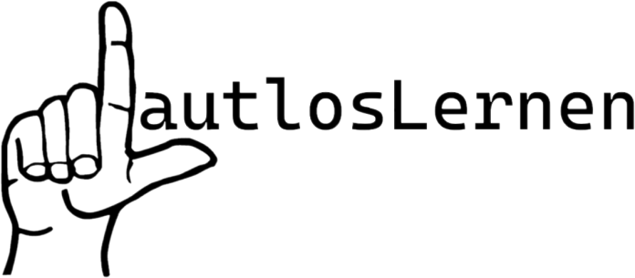

### Gruppenmitglieder
<table>
  <tr>
    <th>Name</th>
    <th>Kürzel</th>
  </tr>
  <tr>
    <td>Tim Buckenthien</td>
    <td>wi22162</td>
  </tr>
  <tr>
    <td>Leni Grohmann</td>
    <td>wi22020</td>
  </tr>
  <tr>
    <td>Mia Holzkamp</td>
    <td>wi22160</td>
  </tr>
  <tr>
    <td>Kai Keppler</td>
    <td>wi22234</td>
  </tr>
  <tr>
    <td>Edona Lokaj</td>
    <td>wi22108</td>
  </tr>
</table>

## Aufbau
Der Code ist nach dem [MVC-Modell](https://en.wikipedia.org/wiki/Model%E2%80%93view%E2%80%93controller) strukturiert.

## Interessante Stellen
// TODO: Interessante Codesnippets o.ä. verlinken.
